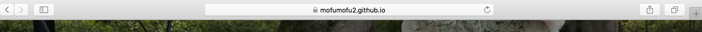

# 問題

## 第１問

次の文章A〜Cを読み，下の問い（問１〜問７）に答えよ。（配点：35点）

トム：やあジェリー、何をしているの？
ジェリー：キャリアアップのためにポートフォリオを作っているのよ。最近はTwitter（1）なんかで転職先や仕事の受注元を探している人も多いから、私も何か準備しようと思っていたの。
トム：さすがジェリー！これはWebポートフォリオだね！Webページも自分で作成したの？
ジェリー：そうよ。HTML（2）は思っていたよりも複雑だったけど、なんとか形になったわ。
トム：デザインしたものを作ってみたい、って言っていたものね。HTMLの書式は本を参考にしたの？
ジェリー：本も見たけれどアが書式のドキュメントをWebページとして公開しているの。それも合わせて参考にしたわ。このサイト内ではイがどのように表示されるかも試すことができて便利なの。
トム：この画像部分（3）の表示が崩れているみたいだね。
ジェリー：そうなの。原因が分からなくて困っているのよ。
トム：よし、僕がみてみるよ。
ジェリー：ありがとう。助かるわ。

### 問１

下線1のTwitterを始めとするWebサービスでは、Webサービスの機能を外部のプログラムから決まった形式で呼び出す機能を提供していることがある。この機能の名称として最も適当な物を選びなさい。

#### 答え

- 1. API

#### 解説

Webサービスでは、Webサービスの機能を外部のプログラムから決まった形式で呼び出す機能のことを **API（Application Programing Interface）**といいます。 **ライブラリ** ・**フレームワーク**と混同されることが多いのですが、利用者と利用される側（作成者）の関係性が違うので、それを抑えることが重要です。両者の関係性を思い描くようにすると、理解が進みやすいでしょう。

1. API
APIの作成者はWebサービスを運営している団体・個人であることが多いです。利用者は作成者が決めた方式で「このデータが欲しい」と問い合わせをします。その後、取得したデータを利用して自身のWebサービスやアプリケーションの処理を行います。
大半の場合、JSON形式でデータをやり取りします。

図書館の書庫から本を出してもらい（APIでデータを問い合わせる）、それを元に論文やレポートを作成する（APIのデータで後続の処理をする）と考えるとわかりやすいです。

絵を描く

2. ライブラリ

ライブラリはある特定の機能だけを補助的に提供するプログラム群のことです。個人・団体を問わず多くの人がライブラリを作成・公開しています。利用者は公開しているライブラリを何らかの形でダウンロード・インストールし、自分のサービスに組み込んで利用しています。

図書館（ライブラリの保管場所）へ行き、目的に合った本（ライブラリ）を選んで論文やレポートを作成する（自分のサービスを作る）と考えるとわかりやすいです。

3. スクリプト

**スクリプト** とは、短いプログラムのことを指しています。スクリプト（script）を直訳すると、``台本・脚本``という意味ですが、その名前の通り記述・実行することが容易であることが特徴です。

これに関連して、 **スクリプト言語** （Scripting Language）というプログラミング言語のカテゴリも存在します。``スクリプト言語``はプログラムを動作させるときコンパイルを必要としない、という特徴を持っている言語です。JavaやC言語などはプログラムを実行する前に、作成したプログラムをコンピューターが認識できる形へ変換する必要があります。[^compile] しかし、スクリプト言語は``インタプリタ``（interpreter）というプログラムが存在します。``インタプリタ``がスクリプト言語をコンピューターが読み取れる形に変換してくれるため、人間がコンパイル作業を実施する必要がないのです。

スクリプト言語の例として、次のプログラム言語が挙げられています。

- JavaScript（JavaScriptの一種であるTypeScriptはコンパイルする必要があります）
- Python（教育用としても利用されています）
- PHP（こちらも初心者におすすめされる言語です）
- VBScript（Excelマクロなどで利用されている言語です）

スクリプト言語の一例として、スクリプト言語の代表選手であるJavaScriptをHTMLの中に記載しました。次のプログラムを実際に実行してみましょう。コンパイルを指示していないはずなのに、ボタンを押すと現在日時が表示されるはずです。

```html
<!DOCTYPE html>
<html>
<head>
  <meta charset="utf-8" />
  <meta http-equiv="X-UA-Compatible" content="IE=edge">
  <title>Example JavaScript</title>
</head>
<body>
  <button type = "button" onclick="document.getElementById('example').innerHTML = Date()">今の日時は？</button>
  <p id="example"></p>
</body>
</html>
```

[^compile]: 問1の問題7の選択肢3.IDEの解説もあわせて参照してください。

4. フレームワーク

**フレームワーク** とは、広義の意味では骨組み・構造のことです。Webアプリケーション開発時にこの言葉が出てきた場合は、アプリケーション開発に必要な部品と、それを呼び出すための仕組みを提供するソフトウェアのことを指しています。

例えば、ログイン処理は多くのWebアプリケーションで求められる要件ですよね。これを毎回0から作成するのは時間がかかります。同じような仕組みで実装する訳ですから、1度作成した部品を再利用したくなります。これがWebアプリケーションにおけるフレームワークを利用したい理由です。

代表的なプロダクトを列挙します。名前を聞いたことがあるものも多いのではないでしょうか。

- Ruby on Rails
- Spring
- Django
- Lalavel

### 問２

下線2に関連して、HTMLのように文書の一部をタグと呼ばれる特別な書式で囲うことで文章の表現を記述する言語として正しいものを選びなさい。

#### 答え

- 3. マークアップ言語

#### 解説

**マークアップ言語** は、文章の表現方法を記述するために考案された言語です。マークアップ言語に属する言語を挙げるので、共通点を探ってみると面白いでしょう。

- HTML（えいちちーえむえる/正式名称はHyperText Markup Language：はいぱーてきすと・まーくあっぷ・らんげーじ）
- Markdown（まーくだうん）
- TeX（てっく・てふ）[^tex]
- textile（てきすたいる）

[^tex]： 読み方はどちらでも正しいです。LaTexときた場合、らてっく・らてふと読みます。

マークアップ言語の代表例である``Markdown``の記述方法を参照してみましょう。この問題・解答の原稿もMarkdownで記述されています。

### 魔法使いプリキュアのメンバーを紹介するぜ！

1. **みらい**
2. *リコ*
3. はーちゃん
4. モフルン

文字を読むことはできますが、記号が邪魔で読みづらいですよね。Markdown対応エディタのプレビュー機能を使って参照すると、どうなるでしょうか？

<!-- 画像を貼る -->

iPhoneのMarkdown対応エディタアプリ``1Writer``（URL： https：//itunes.apple.com/jp/app/1writer-markdown-text-editor/id680469088?mt=8 ）で参照したときのキャプチャです。見やすく装飾されていることが確認できましたか？

このように、マークアップ言語は文字を特定の記号で囲むことで、決まった装飾を施すことができるのです。

1. スクリプト言語

問1で解説しているため、ここでは詳しく取り上げません。

2. 関数型言語

**関数型言語** とは

4. オブジェクト指向言語

**オブジェクト指向言語** とは

### 問３

アにはWebの規格を標準化を進める団体名が入るが、その名称として最も適当なものを選択しなさい。

1. Google
2. Oracle
3. XML
4. W3C

#### 答え

- 4. W3C

#### 解説

**W3C** はWebの標準規格を定める団体です。Webページの規格を統一しておく理由は、いつでもどこでも同じWebページが見えるようにする必要があるためです。

日本とアメリカでは物の長さの単位が違いますよね。センチをインチに変換するのは大変です。これと同じで、Webページの規格が国ごとに違っていた場合、アメリカのWebページを日本から参照することが不可能となってしまいます。
W3Cが定めた規格に沿ってWebページを構成すれば、このような問題を解消することができます。HTML・CSSはW3Cがチュートリアルページを作成しています。言語学習時にはとても役立ちますので、覚えておくと良いでしょう。

1. Google

Webページの検査エンジンやメール機能を提供する大企業です。Androidを開発している企業でもあります。Googleのサービスは``Google Cloud Platform``というサービス上で運用されています。これをクラウドコンピューティングという形で提供していたりもします。これからもWeb技術の最先端を駆け抜ける企業であり続けるでしょう。

2. Oracle

``Oracle Database``や``Java``を開発している企業です。このように、ある特定の言語・ミドルウェア・サービス・PC機器を提供する企業のことを``ベンダー``と呼びます。

Oracleはその代表格です。Oracleが開発・運用している技術を利用する際は、ライセンスを購入する必要があることが多いです。利用条件は良く確認しましょう。

次のリストはOracleの提供しているサービスの一例です。

- Oracle Database
- Java
- Virtual Box
- Wercker（ http：//www.wercker.com）

3. XML

**XML（Extensibe Markup Language）** とは、マークアップ言語の一種です。XMLの特徴は自分でタグを作成できることと、Webページの作成以外でも利用できる言語だということです。例えば、Javaアプリケーションの階層の記述はXMLで記載されています。他には、ミドルウェアのログがXML形式で出力されていることもあります。

XMLとHTMLは``SGML（Standard Generalized Markup Language）``から派生した言語です。HTMLはWeb上で文章を表示することに特化していますが、XMLは機能を拡張できるように改良されました。動物の進化と似ていますね。どちらもW3Cによって規格の標準化が進められています。


### 問4

音声形式で情報を配布するものとして、最も適当なものを選択しなさい。

### 解答

1. ポッドキャスト

### 解説

Webサイトの更新履歴を配信するためのファイルのことを、　**フィード** といいます。フィードを取得すると、Webサイトでどこが更新されたかを収集することができます。Webの記事をまとめているサイトは、この``フィード``の仕組みを利用しています。この中でも、音楽や動画情報を配信する仕組みのことを **ポッドキャスト（Podcast）** といいます。Apple社がポッドキャスト専用のフィードを所有しているため、認知度はかなり高いフィードの形式と言えるでしょう。

他の選択肢は、全て文字が配信内容の中心になっています。色々なPodcastが配信されているので、好きなものを探して視聴してみると良いでしょう。不定期配信の雑誌が音声購読されている、そんな気分を味わうことができます。

2. RSSフィード

**RSSフィード** （あーるえすえすふぃーど/正式名称はReally Simple Syndication：りありー・しんぷる・しんでぃけーしょん）とは、フィードの形式の１種です。``RDF``という言語で書かれた``RSS1.0``と、``XML``で書かれた``RSS2.0``が存在します。株式会社はてなが運営する``はてなブックマーク``（URL：http：//b.hatena.ne.jp/）というサービスでは、各URLの末尾に``.rss``とつけると、RSS2.0形式のRSSフィードを参照することができます。

<!-- URLも含めてスクリーンショット入れる -->


3. SNS

**SNS** （えすえぬえす/正式名称はSotial Networking Service：そーしゃるねっとわーきんぐさーびす）は、人と人とのつながりを支援するためのWebサービスの総称です。代表例をいくつかあげると、「おっ！それしってるがな！」となるかもしれません。

- Facebook
- Twitter
- LINE
- Instagram
- mixi

LINEはチャットツールだからSNSじゃないのでは…？と思われる方もいらっしゃるかもしれません。しかし、LINEがニュースに上がるとき、SNSの１種として紹介されています。特定個人とのチャット以外にも、タイムラインで近況報告をする機能や``Face Play``（ふぇいすぷれい）という顔の動きで点数をきそうゲームがあるのはご存知でしょうか。これらの機能は人同士のつながりを促進するために存在しています。よって、LINEはSNSの１種なのです。

4. 検索エンジン

**検索エンジン** とは、入力した文字情報を元に情報を探し出して表示するシステムの名称です。問３の選択肢に``Google``が出てきましたが、Googleは``Google Serch（ぐーぐるさーち）``という検索エンジンを運営しています。「OK、Google！ リコちゃんについて調べて」などと話しかけると、裏では検索エンジンを利用してリコちゃんについての情報収集を行なっているのです。

<!-- キャプチャ入れる -->

検索エンジンを運営しているサービスは、Google以外にも存在しています。例をいくつか挙げておきます。個人で利用する場面は少ないかもしれませんが、会社によってはPC内で利用できる検索エンジンが制限されていることもあります。

- Bing
- Yahoo!

検索エンジンは``ロボット型``と``ディレクトリ型``の2種類が存在します。``ロボット型``はプログラムによってWeb上の情報を収集し、カテゴリー別に保管している検索エンジンです。Googleはロボット型の検索エンジンを採用しています。「SEOを高めて自サイトの認知度をあげましょう！」という広告を見かけた場合、9割方はGoogle Analytics（ぐーぐるあなりてぃくす）のプログラムに検出されやすくなるWebページの作り方を伝授します、というのと同義です。

一方、``ディレクトリ型``は人間がWebページの情報をカテゴリー別に整理・保存している検索エンジンです。手間はかかりますが、人間によってWebページが閲覧されているので意味のあるカテゴリ分けがされています。Yahoo!はディレクトリ型の検索エンジンです。

Webエンジニアの人は、Googleを検索エンジンとして利用していることが多いです。そのせいか、ちゃんと調査したかを質問するネットミームの中に「それ、ググった？」「GGKS（ググれカス）」という言葉が存在しています。Googleで検索した？という意味ですので、覚えておきましょう。ただし、人にカスと言ってはいけないと思います。

### 問５

イにはHTMLの体裁を表現する記述方法の名称が当てはまるが、この名称として最も適当なものを選択しなさい。

1. HTML
2. JavaScript
3. CSS
4. Java

### 問６

ジェリーはで非可逆圧縮方式の静止画像を、自身ポートフォリオ内で使用している。このときジェリーが使用した画像の保存形式として最も適当な物を選択しなさい。

#### 答え

4. JPEG

#### 解説

**JPEG** とは、画像を保存するための拡張子の一種です。　**拡張子** とは、ファイルの保存形式のことです。拡張子ごとに音楽データを保存するもの、テキストを保存するもの、プログラムを保存するもの…と役割がわかれています。JPEG拡張子は ``.jpg`` ・ ``jpeg`` という名前で画像を保存しています。JPEGは **非可逆圧縮方式** でデータを保持しています。よって正解は``4`` となります。
**非可逆圧縮方式** とは、ファイルのサイズを小さくする代わりに、データの一部を削除してしまう方式のことです。ファイルのサイズが小さいので、多くの画像ファイルを保存できます。しかし、データを一部消して保存するため、画質は悪くなります。元の拡張子に戻したとしても、綺麗な状態に戻すことはできません。

ちなみに、iPhoneの写真モードでは``.jpg``方式で画像が保存されています。小さいスマートフォンにたくさん画像を詰め込んでおく必要があるからなのでしょう。

<!-- スクリーンショット -->

1. PNG

**PNG** とは、画像を保存するための拡張子の一種です。``JPEG``と違う点は、 **可逆圧縮方式** を使ってデータを保存する点です。 **可逆圧縮方式** は、データの欠けがない状態でデータを圧縮する方式のことです。データの欠けがないため、綺麗な画像を保存することができます。その代わり、データの容量は大きくなってしまいます。

透明な画像を利用したい場合、``PNG``形式でファイルを保存することが望ましいでしょう。Webページに利用されている画像の多くは``.png``形式で保存されています。これは、プラウザに付属しているディベロッパーツールで参照することができます。

<!-- スクリーンショット -->

2. GIF

**GIF（Graphics Interchange Format）** とは、画像を保存するための拡張子の一種です。``ジフ``が正しい読み方とされています。GIFの大きな特徴として、複数枚の画像を1つのファイルに保存することで、短いアニメーションが作成できる（GIFアニメーション）が挙げられます。SNSやLINEスタンプで画像が動いているものが多く見られますが、あれがGIFアニメーションです。

GIFは可逆圧縮方式でデータを保存することができますが、256色以下の画像のみ扱うことができます。制限が付いている代わりに、他の画像拡張子では表現できない動きを扱うことができる、と考えると良いでしょう。

3. ai

**ai** は **Adobe Illustrator** というイラストを描画するソフトで作成した作品を保存するための拡張子です。イラスト描画ソフトは、独自の拡張子を用いてファイルを保存していることが多いようです。

### 問７

Webページを閲覧するために利用するアプリケーション名として最も適当なものを選択しなさい。

#### 答え

1. Webブラウザ

#### 解説

**Webブラウザ** とは、Webページ内に存在する``ハイパーテキスト`` [^h] を解釈し、表示するためのアプリケーションです。例えば、次のようなHTML・CSSがあったとします。

<!-- HTML・CSSを記載する -->


このままでも何が書いてあるか読めなく…はないのですが、読みやすいとは言いづらいですよね。そこで、このページをブラウザを通して参照してみます。

<!-- スクリーンショットを記載する -->

かなり読みやすい形になりました。これが、Webブラウザの役割です。

Webブラウザには種類があり、種別ごとに表示され方が違う…などということもあります。ブラウザ特有の不具合が発生することもあるようで、Webページを作るのも簡単ではなさそうです。

[^h]： HTMLの解説を参照してください

2. エディタ

**エディタ** とは、コンピューター上で上で文字だけのファイルを作成・編集するためのアプリケーションです。 **テキストエディタ** と呼ばれていることもありますが、この本では``エディタ``表記で統一することにします。プログラムやWebページ（HTML・CSS）をエディタで作成すると、``シンタックスハイライト`` という色でプログラムの内容をわかりやすくするサポートの拡張が受けられます。他にもプログラムの見た目を自動で整形したり、文字を検索・置換する機能も提供しています。Webに関わる何かを開発するのであれば、エディタを利用することを強くお勧めします。 [^2]

[^2]： 前職でコンフィグファイルをWindowsのメモ帳で編集しているツワモノがいました。人の趣味・思考なので自由にしてもらえばと思いますが、便利なものがあるのでうまく乗り換えた方が良いのでは…。

エディタの例をいくつか挙げます。使い方ページやブログでのレビューを参考に、自分にあったお気に入りのものを使いましょう。エディタによって得意な言語・苦手な言語もあるので、その辺も含めて検討すると良さそうです。ライセンスが必要なものはきちんと購入しましょう。それと、``Vim``と``Emacs``は利用者の愛着がかなり強く、一種の宗教戦争状態になっています。言動を間違えると戦争が始まってしまうので気をつけましょう。

- Visual Studio Code
- Atom
- Vim
- Emacs
- Sublime Text
- Brakets

3. IDE

**IDE** は、エディタの機能とプログラムを実行する環境が1つのアプリケーションにセットになっているものです。例えばJavaのアプリケーションを実行する際は、3つのステップを踏む必要があります。

1. Javaプログラムを記載し、``.java`` 拡張子で保存する。
2. 保存したファイルを``.jar``ファイルに変換し、コンピューターが読み取れる形式に変換する。（``コンパイル``）
3. 変換したものを実行する

IDEを使うと、工程が1つ減ります。

1. Javaプログラムを記載し、``.java`` 拡張子で保存する。
2. IDEの機能でプログラムを実行する。

変換作業がなくなるだけでも楽ができますね。さらに、IDEはWebアプリケーションの動作に必要な環境を擬似的に構築・実行することが可能です。プログラムを作成してサーバーにアップロード…という手間を省いて動作を確認することができるのです。便利ですね。

ただし、JavaScriptやHTMLなどはブラウザを通してプログラムを実行することができます。開発する対象物や環境に応じてIDEとエディタを使い分けると良いでしょう。代表的なIDEも合わせて紹介します。

- Eclipse
- IntelJ

4. コンテナ

**コンテナ** はアプリケーションの動作に必要な物プログラム（設定ファイル・ライブラリを含む）全てを、実行ファイルとしてまとめた仕組みの事を指します。この問題ではWebページを閲覧するためのアプリケーションは何か？を問うているため、Webページの実行環境であるコンテナは選択肢の対象外となるのです。

コンテナの特徴は、コンテナアプリケーションを動作させているOSを利用して動作する事です。コンテナ技術の比較対象となる``ハイパーバイザ``（Hyper Visior）では、アプリケーションの実行環境用のOSをハイパーバイザ環境に構築する必要があります。2つの違いを図に示しました。

<!-- 図を入れる -->

コンテナは、``Docker``社が提供する``Docker``というツールが有名です。この問題では

コンテナを利用したアプリケーション実行環境の構築が便利ですよ、と言われている理由をいくつか挙げます。

- アプリケーション実行環境の再配布[^distributionenv]がしやすい
- アプリケーションの動作をテストする・アプリケーションを公開する動作環境を作成しやすい

[^distributionenv]: 環境を作成した人以外の誰かに環境構築をしてもらうこと

## 第２問


次の文章を読み，下の問い（問1〜8）に答えよ。（配点：40点）

2018年2月、Googleはアで接続しているWebページ・WebアプリケーションのURLにアクセスすると、「このWebページは安全ではありません」という警告を表示するように仕様を変更すると発表した。イからアでアクセスしている場合、サイトの内容に関わらず警告が表示される。このため、多くのサイト管理者は対応を余儀なくされている。

### 問１

Webアプリケーションのデータを送受信するとき、3ウェイハンドシェイクを用いて通信している。そのとき2番目に発生する通信は何か。最も適当なものを選択しなさい。

1. ACK
2. SYN + ACK
3. SYN
4. FIN

### 答え

2. SYN + ACK

### 解説

私たちがWebページやWebアプリケーションの情報を見ているとき、裏では **TCP** （てぃーしーぴー/正式名称はTransmission Control Protocol：とらんすみっしょん・こんとろーる・ぷろとこる）というプロトコルで通信が行われています。**プロトコル** とは、ネットワーク上に存在する機器が通信をする際に利用するための決まった手順の事をいいます。機器同士が通信する方法の規格、と考えると良いでしょう。世界共通言語がないとコミュニケーション時に困ってしまうのと同様、Webの世界にも世界共通言語が存在するのです。TCPはその世界共通言語、というわけです。

TCP通信が開始されたとき、まず最初にサーバーとクライアント間で通信テストを行います。相手が存在する事を確認した後にWebページの送信を行うのです。これを **3ウェイハンドシェイク** といいます。3はスリーと読まれることが多いですね。この問題は3ウェイハンドシェイクの2番目にやり取りされる内容は何ですか？ということを問うているのでした。

それでは、3ウェイハンドシェイクの流れを確認してみましょう。1から3が、3ウェイハンドシェイクの流れです。

1. クライアントからサーバーに対してSYNパケットが送られる
2. サーバーからクライアントにSYN + ACKパケットが返ってくる
3. クライアントからサーバーにACKパケットが送られる
4. Webの内容を送受信する

なので、正解は2番となります。

FINパケットは通信を終了（切断）したいときに送受信されるパケット名です。

### 問２

Webアプリケーション自身がエラーを応答するときに表示されるエラー番号として最も適当なものを選択しなさい。

### 答え

1. 500

### 解説

Webページの表示をする際、何かしらの原因で不具合が生じることもあるかもしれません。不具合にも一定の傾向がありますから、決まったエラー番号にしておけば少しは調査が楽になるかもしれません。

そこで、IETF（あいいーてぃーえふ/正式名称はInternet Engineering Task Force：いんたーねっとえんじにありんぐたすくふぉーす）という団体が、通信の状態に番号をつけましょう！という内容の論文をいくつか発表しました（例：https://tools.ietf.org/html/rfc7231）。HTTP通信をする場合、この論文に沿って通信状態に番号がついています。これを``ステータスコード``と呼ぶことがあります。

もしHTTP通信中に不具合が起こった場合、``ステータスコード``を確認すると不具合の箇所を絞り込むことができます。ステータスコード200・400・403・404・500は登場頻度が多いので、まずはここから意味を抑えておくと良いでしょう。ステータスコードの例を表に記載しましたので、合わせて確認してください。


### 問３

選択肢の中で、HTTPリクエスト・レスポンス両方に含まれているヘッダーフィールドはどれか。

### 答え

1. エンティティ

### 解説

**ヘッダーフィールド** とはHTTP通信時にどんなやり取りがされているかを記録している場所です。 **エンティティヘッダーフィールド** は、HTTPリクエスト・レスポンス、どちらのときも記載されるヘッダーフィールドです。

実際にみてみよう！！！！！

**リクエスト（request）** とは、クライアントからサーバーにデータを要求する処理のことです。 **レスポンス（response）** はこの逆で、サーバーがクライアントにデータを返却する処理のことです。各ヘッダーフィールドにはこの情報が記載されています。

…とか言われても訳がわかりませんね。本題からそれますが、``初心者向け！``とか謳っているWebページでこの説明されたら「初心者向けちゃうやんけ！！！！！！」と言いたくなりますよね（10敗）。画面を叩き割りたくなるってもんです。この本を破り捨てられると困るので、もう少し詳しく説明します。

まず、このような順番で考えることにしましょう。

1. 英単語``request``の意味はなんでしょう？
2. 英単語``response``の意味はなんでしょう？
3. 誰が誰に``request``するのでしょう？
4. 誰が誰に``response``するのでしょう？

英単語``request``を辞書で引くと、

- 要求する
- お願いする
- 頼む

と出てきます。動詞（V）ですね。 リクエストは``なにかを頼む``という動作だ、と推測できます。

今度は``response``を辞書で引いてみます。

- 返答
- 反応
- 応答

こちらは名詞（n）です。レスポンスは``返事``のことを示している、と推測できます。

今度は``誰が、誰に``という点を考えてみましょう。登場人物は2人です。

- Webページを見たい人
- Webページの内容を提供する人

リクエスト（request）はなにかを頼むという動作です。Webの世界で、お願いする動作をしそうな人は誰でしょうか？

お願いしそうな人といえば、 **Webページを見たい人** ですよね。「ページの内容をくれ！」とお願いしなければ、Webページの中身を閲覧することはできません。
ここから、Webページの内容を提供する人はお願いされる立場だ、と推測できます。

今度はレスポンス（response）も推測してみましょう。Webの世界で返答・反応しそうな人は誰でしょう？

何かをお願いされた人は、「やりましたよ/できませんね」と返事をしないとダメですよね。ということは、 **Webページの内容を提供する人** が返答・反応する人、と推測できます。返答する相手は、お願いしている人ですよね。よって、Webページを見たい人に返事をする、と推測できます。

最後に、登場人物に専門用語を当てはめてみましょう。

- Webページを見たい人＝クライアント
- Webページの内容を提供する人＝サーバー

そして、説明を再度確認してみます。

>リクエスト（request）とは、クライアントからサーバーにデータを要求する処理のことです。レスポンス（response）はこの逆で、サーバーがクライアントにデータを返却する処理のことです。

今度は、なるほど感を感じるのではないでしょうか？このように、技術用語は英単語が元になっていることが多いです。意味不明なときは、英単語の意味と役割から内容を推測してみましょう。

### 問4
 
Webページの内容を生成する役割を持つミドルウェアや処理形式の名称として最も適当なものを選択しなさい。

### 答え

2. Webアプリケーションサーバー


### 解説

まずはこの図を見てください。これは良くあるブログを運営するためのWebアプリケーション構成図です。``構成図``とは、アプリケーションや機械に必要な要素や並び方を図解したものです。``ラック構成図``という文言だと、サーバーをしまっておく棚＝ラック内の並びを図解している、という意味になります。

各要素の役割を説明する前に、どのような流れで処理がされるかを説明します。

1. クライアントが``もふもふブログ``の``uraniai``ページにアクセスする
2. Webアプリケーションサーバーが``uranai``ページに必要な情報をDBサーバーから取得する
3. 2で取得した情報を使ってWebアプリケーションサーバーは動的に変化する部分を作成する
4. Webサーバーができあがった``uraniai``ページをクライアントに返却する

1. DBサーバー
3. Webサーバー
4. NAS

### 問５

イにはWebページやWebアプリケーションを利用するパソコンという意味の用語が入る。最も適当な用語を選択しなさい。

### 答え

3. クライアント

### 解説

WebページやWebアプリケーションを利用するパソコンを **クライアント** といいます。 **ユーザー** はWebページやWebアプリケーションを利用する人の事を指します。リクエスト・レスポンスの解説は問４を参照してください。

### 問６

HTTPS通信プロトコルとして最も適当なものを選択しなさい。

### 答え

1. TCP/IP

### 解説

**TCP/IP**（てぃーしーぴーあいぴー/正式名称はTransmission Control Protocol/Internet Protocol）とは、インターネット上で利用されるプロトコルの規格のことです。TCP/IPは **TCP** プロトコルと **IP** プロトコルと **HTTP** プロトコルと **HTTPS** プロトコルと…

はい、もういいですね。``TCP/IP`` はインターネット通信で使われるプロトコルたちの総称なのです。``緑黄色野菜``がβカロテンを多く含む野菜（ニンジン・かぼちゃトマト・クレソン...etc）の総称なのと一緒です。

``プロトコル``の説明は、第2問の問1を参照してください。

2. IPsec

**IPSec** （あいぴーせっく/正式名称はSecurity Architecture for Internet Protocol：せきゅりてぃあーきてくちゃふぉあいんたーねっとぷろとこる）とは、暗号技術を利用して通信内容を保護することができるプロトコルです。

<!-- 複雑なのでどうするか迷うもん -->

3. NAS

**NAS** （なす/正式名称はNetwork Attached Storage：ねっとわーくあたっちどすとれーじ）とは、ネットワークに接続して利用するタイプのファイルサーバーです。``ファイルサーバー`` とは、ファイルを保管・共有するための共有スペースのことです。Google Drive・iCloud・EverNoteなど、ファイルをインターネット上に保存できる仕組みを思い浮かべていただくと、NASの役割は理解しやすいです。

ファイルサーバーが存在しない場合、自分の作った猫ちゃんの絵を共有するためにはメールか何かで送信する必要がありますね。これでは絵を描く人・確認する人どちらも面倒です。ファイルサーバーがあれば、修正を施したときにファイルを再度置き直せば良いですし、確認する側はファイルサーバーの内容をチェックすれば良いだけです。やったね！…という環境を、インターネット上に作りますからね、というのがNASくんの役割です。

企業などで、情報を自身のネットワークだけに隠しておきたい場合、インターネット上で提供されているファイルサーバーを使われると困ってしまいます。そこでNASを準備して、そこに秘密のファイルを隠しておく、といった使い方がされたりします。個人で利用することは少ないのですが、例えばアニメの録画を自前のNASに保存する、なんて人もいるようですよ。``NAS アニメ録画`` で検索検索！

4. FTP

**FTP** （えふてぃーぴー/正式名称はFile Transfer Protocol：ふぁいるとらんすふぁーぷろとこる）とは、コンピューター同士の間でファイルを送受信するときに利用されるプロトコルの名前です。``FTP入稿``という言葉を聞いたことはありますか？同人誌を印刷したいナ〜というときに、出版社の比較をしますよね。そのとき「ご入稿はFTP入稿をご利用ください」と書いてある印刷所さんもあるのです。[^ftp]原稿のデータをフォームから送信すると、同人印刷所さんにデータが届きます。このときに使われているのが``FTP``というプロトコルなのです。

ただし、``FTP``プロトコルには問題を抱えています。なんと、通信の内容が暗号化されていないのです。つまり、他の人がプロトコルの内容を観察することができるのです。これは困りますね。同人データならまだ秘密の情報は存在しません[^doujin]。しかし、今度出す新商品の企画案だった場合はどうでしょうか。FTPを使ってやりとりをした場合、ライバル企業に盗み見されてしまうかもしれないのです。困った！

…ということで、 **SCP** （えすしーぴー/正式名称はSecure Copy Protocol：せきゅあこぴーぷろとこる）や **SFTP** （えすてふてぃーぴー/正式名称はSecure File Transfer Protocol）といったファイルを暗号化しつつ、かつコンピューター同士で転送を行うプロトコルを使うのが主流となっています。送信時にファイルの内容を暗号化してしまうので、他の人がプロトコルの中身を見ようとしても謎の文字列しか見えない、というわけですね。

[^doujin]： 見られるとはっずかし〜〜〜〜〜〜〜などという思いはあるかもしれませんが、それはまた別のハナシです。

[^ftp]：例：https：//www.taiyoushuppan.co.jp/doujin/ftp/index.php

### 問７

アにはインターネット通信で利用される暗号化されていないプロトコル名が入る。最も適当なものを選択しなさい。

### 答え

4. HTTP

### 解説

まず``プロトコル``ですが、この説明は第2問の問1を参照してください。

**HTTP** （えいちてぃーてぃーぴー/正式名称はHypertext Transfer Protocol：はいぱーてきすととらんすふぁーぷろとこる）とは、HTMLなどのWeb文章をやり取りするためのプロトコルです。HTTP通信の特徴として、通信内容が暗号化されていないことが挙げられます。次のURLのどれかにアクセスしてみてください。ブラウザのURLが記載されている欄に注目します。ちなみに筆者はGoogle Chromeを利用しています。

- http：//www.mlit.go.jp/
- http：//www.mbga.jp/_game_intro?game_id=12017647
- http：//www.sagawa-exp.co.jp/send/howto-search.html


``保護されていない通信`` と出ていますね。問2の文章はこれのことを示しているのです。他のブラウザで見た場合、次の画像のように表示されます。筆者はSafariを使っています。


アドレスから``http`` という文字が省略されているようです。

一方、**HTTPS** （えいちてぃーてぃーぴーえす/正式名称はHypertext Transfer Protocol Secure：はいぱーてきすととらんすふぁーぷろとこるせきゅあ）のURLを持つサイトはどうでしょうか？次のURLのどれかにアクセスしてみましょう。

- https：//techbookfest.org/
- https：//www.shippo.co.jp/neko/
- https：//mofumofu2.github.io/hiyokoMofu-fm/

Chromeでアクセスしたとき、筆者の手元ではこのようにURLが見えています。


Safariでアクセスしたときは、このようになっています。


``保護されている通信``と記載がある・鍵マークが付いているなど、何かしら守られていそうな雰囲気ですね。HTTPSは ``Secure`` の名前通り、Web文章をやりとりするときに暗号化の処理をおこなってくれるプロトコルです。 ``HTTP over SSL/TLS`` と呼ばれていたりもします。 ``SSL/TLS`` （えすえすえる・てぃーえるえす）は暗号化方式の名称で、

- 盗聴
- Web文章の改ざん
- Webサーバーのなりすまし

の3つを防ぐことができます。3つ目を実施するためには、``SSL証明書``というものを利用します。SSL証明書をみれば、「おたくは本物ですね」とブラウザが解釈することができるのです。SSL証明書の発行には、``認証局``と呼ばれる発行業者に認められる必要があります。好き勝手にSSL証明書を作成できないようになっているため、インターネットの平和は守られるというわけです。

じゃあみんなHTTPSのサイトにすればいいやん！って話になるはずですよね。そうはなっていない理由として、

- SSL証明書の発行にお金がかかる
- 証明書を発行して適用できるエンジニアが（サイトを運用する企業・団体の中に）いない
- 証明書の利用期限が切れてしまったが更新していない

…などという事情があります。証明書にも格があり、安全性に応じて費用もそれなりに発生します。要件に応じて証明書を選定・適用するためには、インターネット通信の仕組みをある程度理解していないと難しそうです。

とはいえもう平成も終わるわけですから、Webサイトを運営する皆様方はどうか予算を出してHTTPS化対応を進めていただきたいものです。

<!-- 渋川さんの本をよみつつ解説をブラッシュアップする -->

2. POP

**POP** （ぽっぷ/正式名称はPost Office Protocol：ぽすとおふぃすぷろとこる）とは、メールサーバーから自分のパソコンにメールの内容を送るときに利用されるプロトコルです。郵便受けに自分のメールをPostしてもらう、と考えるとわかりやすいでしょう。

3. SMTP

メールを送信するときは **SMTP** （えすえむてぃーぴー/Simple Mail Transfer Protocol：しんぷるめーるとらんすふぁーぷろとこる）というプロトコルを利用します。 ``POPの逆`` と覚えておくとよいでしょう。

### 問8

Webアプリケーションに対する負荷を調整するための機材名称として最も適当なものを選択しなさい。

### 答え

1. ロードバランサー

### 解説

**ロードラバランサー** は、Webアプリケーションに対する負荷を適切な数値に保つために使用される機器です。

2. LAMP

LAMP（らんぷ）とは、

- Linux（りなっくす）
- Apache（あぱっち）
- MySQL（まいえすきゅーえる）
- PHP（ぴーえいちぴー）

で構成されているWebアプリケーションの総称です。問題2の問6でも出てきた``緑黄色野菜``と同じような扱いです。
Wordpress（わーどぷれす）は、LAMP構成の代表選手です。Webサイトを作成・運営ができるアプリケーションです。記事の作成はWordpressの管理画面から行うことができますし、ブログの見た目をHTML・CSSなどを用いてカスタマイズすることも可能です。

3. lint

**lint** （りんと）とは、主にC言語で作成されたプログラムの内容が正しくできているのか？を検査するためのプログラムです。ただし、最近は言語用のlintツールが登場しているため、 ``lint`` という文字が登場した場合「何かしらのプログラムを検査するツールかな」と思っていただくのが良いと思います。いくつか例をあげておくので、自分のお好きな言語で取り入れてみるのはいかがでしょうか？同じ言語でもlintツールが複数開発されている場合もありますし、あなただってlintツールを作成できるかもしれませんよ。

- [ESLint/JavaScript用のlintツール](https：//eslint.org/)
- [RuboCop/Ruby用のlintツール](http：//docs.rubocop.org/en/latest/)
- [Pylint/Python用のlintツール](https：//www.pylint.org/)
- [Golint/Go用のlintツール](https：//github.com/golang/lint)
- [Error Prone/Java用のlintツール](https：//errorprone.info/)

4. Telnet

**Telnet** （てるねっと）とは、

<!-- インフラエンジニアの教科書あたりを参考にする -->

## 第３問

次の文章を読み，下の問いに答えよ。（配点：8点）

あるコミュニティで，持ちまわりで勉強会を主催することになった。このとき，勉強会の運営スタッフを毎回ランダムで選出したい。
そこで，簡易的なWebシステムを作成することになった。必要な機能は次の通りである。

- スタッフメンバーの登録機能
- 勉強会ごとのスタッフメンバー選出機能
- スタッフメンバーごとにスタッフ回数を参照する機能

### 問１

このWebシステムを構築するために必要な構成を作図しなさい。このとき，次の単語を最低１回ずつ使用すること。構成図に具体的なサービス名は記載しないこと。
例）MySQLを構成図に加えたい場合``RDB``と記載する。

- Webアプリケーションサーバー
- Webサーバー
- RDB
- ロードバランサ
- ブラウザ

### 解答例


採点ポイントを挙げますので、ご自身の作品と照らし合わせつつ採点を実施してください。``線で結ばれている``は直線一本でも良いです。

1. WebアプリケーションサーバーがWebサーバーと同じサーバーに存在する、もしくはロードバランサ→Webアプリケーションサーバーの順になっていないこと
2. Webサーバーがロードバランサと線で結ばれていること
3. WebアプリケーションサーバーとDBが線で結ばれていること
4. ロードバランサとブラウザが線で結ばれていること

### 解説

Webアプリケーションの通信の流れが理解できているか？という問題です。問2の問題8にも出てきた``LAMP``構成になるべく寄せて出題してみました。各単語の役割を再度チェックしてみましょう。特に ``Webアプリケーションサーバー`` と ``Webサーバー`` は役割を混同しやすいので注意が必要です。「これなんだっけかな〜」と思ったら、問1・問2の問題に戻って確認してみましょう。

- Webアプリケーションサーバー
  - ページの内容を生成する
- Webサーバー
  - URLに応じたページをクライアントに返却する
- RDB
  - データを表形式で保存する
- ロードバランサ
  - データの通信量を制限する/特定のURLを別のURLに転送する
- ブラウザ
  - ハイパーテキストを解釈して人間が見やすい形に描画する

さらにステップアップするためのアイデアをいくつか記載します。あなたならどうしますか？

- この構成をクラウドサービスで実現したい場合、どのようなサービスを利用しますか？構成図と合わせて記載してみてください。
- DBは本当にRDBしか利用できないのでしょうか？
- Webサーバー・Webアプリケーションサーバーの状態を監視するためにはどのような構成を加えれば良さそうですか？
- サーバー自体を動作させる環境はどうしましょう？
  - OSは？
  - そもそもコンテナ群を使いますか？
  - SasSに任せます？

### 問２

次の文章を読み，回答を導くプログラムを組むこと。言語は不問とする。（配点：7点）

A，Bを含む10人から5人のスタッフを選ぶとき，次の問いに答えよ。

#### （１）

A，Bをともに含む選び方は何通りあるか。

#### 解答

- 56通り

下記2つを満たした場合のみ、``3``点を加算してください。

- 作成したプログラムが動作すること
- 最終出力された答えの結果が56通りであること（出力方法・ ``通り`` の有無は考慮せず、計算結果のみ正しいかを確認すること）

#### 問題の解説（1）

まずは **問題自体の解説** から行います。これは数学Iの範囲なのですが、みなさん解答できましたか？もふもふちゃんは数学が苦手なので数学得意ボーイに講義してもらいました。

まず、10人の人がいて、5人を選ぶんですよね。

- はな
- さあや
- ほまれ
- えみる
- ルールー
- いちか
- ひまり
- あおい
- ゆかり
- あきら

まず、10人から5人を選択する流れを追いかけてみましょう。

1. 10人の中から1人（はなを）選ぶ（10通り）
2. ``はな以外の``9人の中から1人（さあやを）選ぶ（9通り）
3. ``はな・さあや以外の``8人の中から1人（いちかを）選ぶ（8通り）
4. ``はな・さあや・いちか以外の``7人の中から1人（ひまりを）選ぶ（7通り）
5. ``はな・さあや・いちか・ひまり以外の``6人の中から1人（ほまれを）選ぶ（6通り）
6. はな・さあや・いちか・ひまり・ほまれが選ばれた

パターンの組み合わせを樹形図で書いてみると、大変なことになります。

しかし、よくみると同じ組み合わせも存在しそうです。

今回は10人の中から5人を選ぶので、同じ組み合わせは排除する必要があります。これを数学の公式で示すと

<!-- 数式を書く -->

となります。

計算方法は次の通りです。

<!-- 数式を書く -->

これで万事解決！と思われるかもしれませんが、今回はA・Bを共に選ぶ方法を求める必要があります。Aをえみる、Bをルールーとすると、えみるとルールーは **ぜったいに組み合わせの中に入れる必要があります** 。2人はえルっとプリキュアなのです。絶対に片方が欠けることは許されません。

ということは、 ``10人から5人を選ぶ`` といいつつも、求められていることは ``残りの8人から3人を選ぶ`` ことなのです。8人から3人を選び、そこにえみるとルールーを足すと5人になりますからね。

よって、計算するべきは8人から3人を選ぶ組み合わせとなります。

<!-- 数式を書く -->

答えは **56通り** となります。

#### プログラムでの計算

では、これをプログラムで計算しましょう。実際の計算は

です。これを実現するためには、どのような文法を利用すれば良いでしょうか？思いつく限り挙げてみますね。

- 掛け算
  - 分数の箇所（1）（2）を計算するのに必要
- 割り算
  - 分数を計算するために必要（分数は割り算で計算するため）

では、まず8通りから3人を選ぶ計算（1）をプログラムで再現してみます。ここではHTMLとJavaScriptを使いますが、みなさんは好きな言語で実施してみてください。HTMLをブラウザで開き、 ``問3 問題1（1）の計算結果`` ボタンを押すと、計算結果が出力されるはずです。

```html
<!DOCTYPE html>
<html>
<head>
  <meta charset="utf-8" />
  <meta http-equiv="X-UA-Compatible" content="IE=edge">
  <title>えみルー</title>
  <meta name="viewport" content="width=device-width, initial-scale=1">
</head>
<body>
  <div id="3_1_1">
    <button id="numerator">問3 問題1（1）の計算結果</button>
    <p id="numeratorPtag"></p>
    <script src="../js/3_1_1.js"></script>
  </div>
</body>
</html>
```

```js
let numeBtn = document.getElementById('numerator');
let numeElm = document.getElementById('numeratorPtag');

numeBtn.addEventListener('click', () => {
  let numeCalc = 8 * 7 * 6;
  numeElm.innerText = numeCalc;
});
```


今度は、重複している組み合わせを取り除く計算を行ってみましょう。HTMLは先ほどの例と同じ物に追記しています。

```html
<!DOCTYPE html>
<html>
<head>
  <meta charset="utf-8" />
  <meta http-equiv="X-UA-Compatible" content="IE=edge">
  <title>えみルー</title>
  <meta name="viewport" content="width=device-width, initial-scale=1">
</head>
<body>
  <div id="3_1_1">
    <button id="numerator">問3 問題1（1）の計算結果</button>
    <p id="numeratorPtag"></p>
    <script src="../js/3_1_1.js"></script>
  </div>
  <div id="3_1_2">
    <button id="denominator">問3 問題1（2）の計算結果</button>
    <p id="denominatorPTag"></p>
    <script src="../js/3_1_2.js"></script>
  </div>
</body>
</html>
```

```js
let denoBtn = document.getElementById('denominator');
let denoElm = document.getElementById('denominatorPTag');

denoBtn.addEventListener('click', () => {
  let denoCalc = 3 * 2 * 1;
  denoElm.innerText = denoCalc;
});
```

#### （２）

Aは選ばれ，Bは選ばれない選び方は何通りあるか。

#### 解答

- 70通り

下記2つを満たした場合のみ、``4``点を加算してください。

- 作成したプログラムが動作すること
- 最終出力された答えの結果が70通りであること（出力方法・ ``通り`` の有無は考慮せず、計算結果のみ正しいかを確認すること）

#### 解答例

### 採点基準

- プログラムで出力された答えが正しいこと。
- 〇〇に値を変更すると〇〇になること。

### 解説

## 第４問

Restful APIについて説明しなさい。このとき、次の項目について説明する文章を含めること。（配点：10点）

- RPC APIとの相違点
- Restful APIを採用するべき場面
- Restful APIの設計原則となる規約の名称とその内容（4つ）

### 解答例


### 解説
